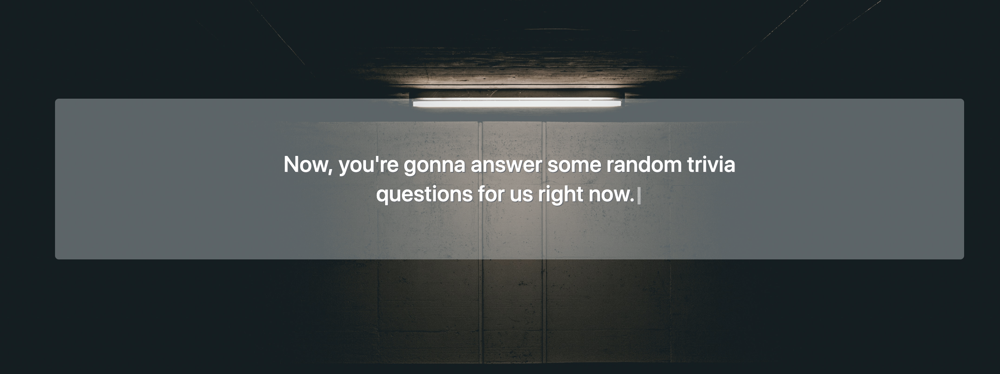
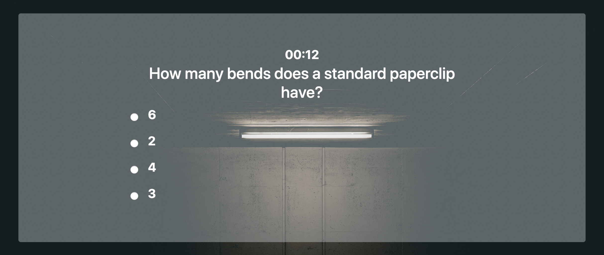

# TriviaGame

[Play the game here](https://jcutlah.github.io/trivia-game/)

A simple trivia game where you have a set amount of time to answer all of the questions. 7 seconds will be given to answer each question. When the timer gets below 10 seconds, the screen will start flashing red. When the timer reaches 0, all unanswered questions are marked as incorrect.

###### Used a 3rd part library for the typing effect, typed.js, courtesy of http://www.mattboldt.com/